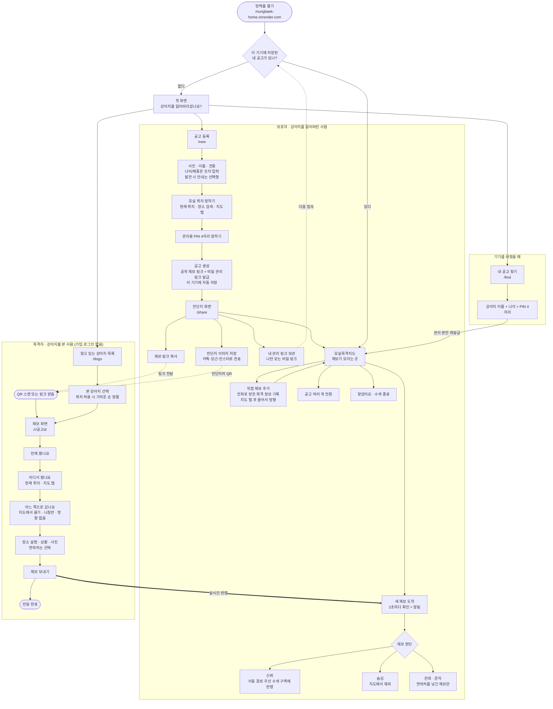
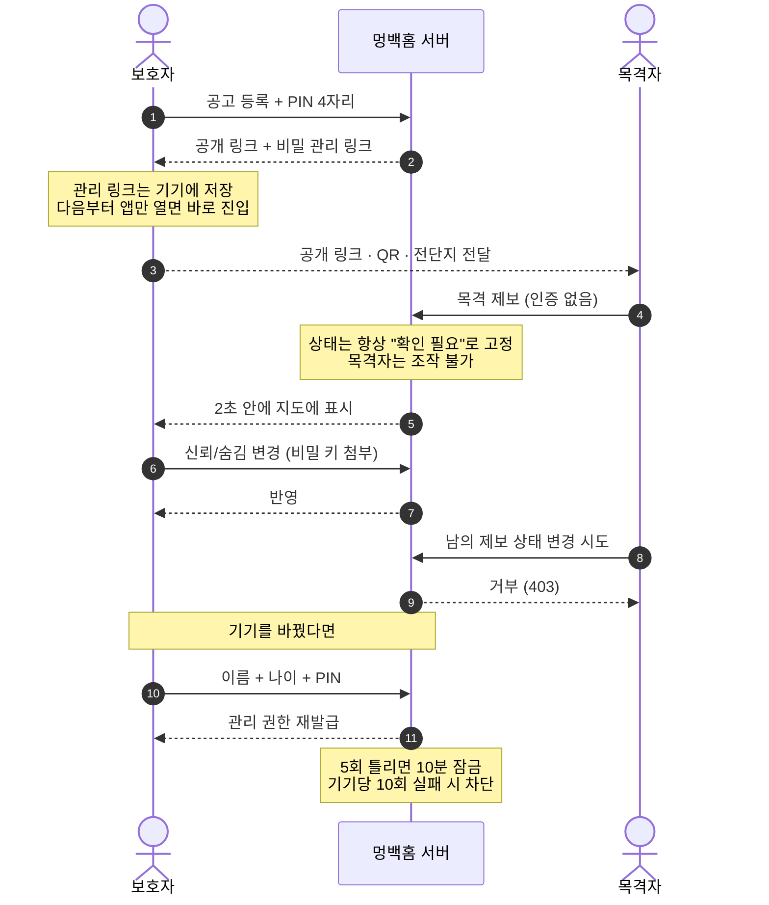

# 멍백홈 · 사용자 플로우

실제 구현된 화면과 동작 기준. (2026-07-31)

---

## 1. 전체 플로우

---

## 2. 누가 무엇을 할 수 있나 (로그인 없는 권한 모델)

---

## 3. 화면 목록

| 주소 | 누구 | 하는 일 |
| --- | --- | --- |
| `/` | 보호자 | 저장된 공고가 있으면 유실목격지도, 없으면 첫 화면 |
| `/new` | 보호자 | 공고 등록 (사진·정보·위치·PIN) |
| `/share` | 보호자 | 전단지 이미지 생성·저장, 링크 복사, 관리 링크 보관 |
| `/m/<비밀키>` | 보호자 | 관리 화면 진입 (열면 기기에 저장되고 주소에서 키 제거) |
| `/find` | 보호자 | 이름 + 나이 + PIN으로 관리 권한 되찾기 |
| `/dogs` | 목격자 | 찾고 있는 강아지 목록, 가까운 순 정렬 |
| `/r/<공고id>` | 목격자 | 목격 제보 (가입·로그인 없음) |
